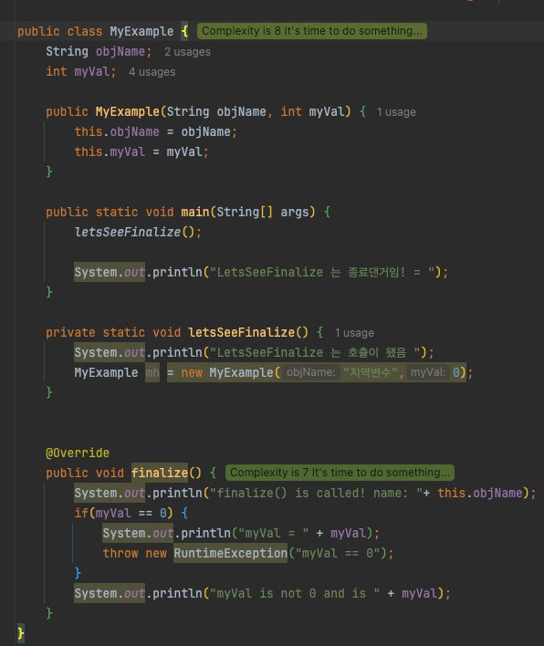
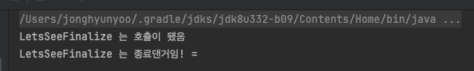
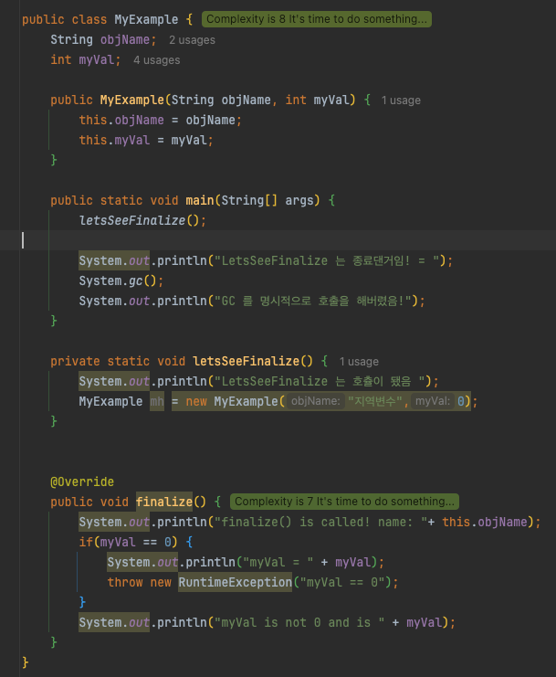
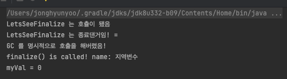
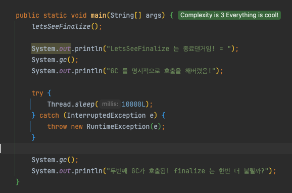
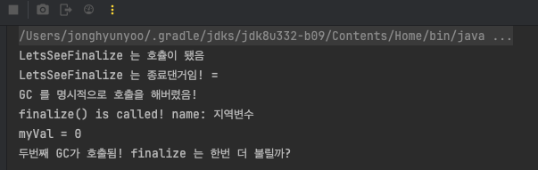

# Ch.12 모든 클래스의 부모는 Object에요
- 모든 클래스가 Object 를 상속받는 이유: Object 의 메서드들이 클래스의 가장 기본적인 행동을 정의할 수 있기 때문이다.
  - 객체를 처리하기 위한 메서드
    - protected Object clone() -> 객체의 복사본 생성 후 리턴 
    - public boolean equals(Object obj) -> 현 객체와 매개변수로 받은 객체의 비교
    - protected void finalize() -> 객체의 생명주기가 다 했을 때 가비지 컬랙터 (GC) 가 호출하는 메서드.
      - 이 메서드의 동작 원리는 (대충이라도) 어떻게 될까?
        - 이 메서드는 JVM 에서 이 객체의 주소값이 어느 스레드에서도 호출되고 있지 않다고 판단될 때 GC에 의해 메모리에서 해제되기 직전에 호출되어 최후를 맞이하기 전에 처리할 동작을 정의하기 위해 존재. 
      - 저자는 이 메서드에 대해 자바를 잘 알게 된 이후에도 신경쓰지 말라고 했다. 이유는 무엇일까?
        - 이 메서드의 호출 스레드가 어떤 쓰레드인지 보장할 수가 없다.
          - 
          - 이 코드의 실행 결과 (java 8 에서만 가능)
          - 
          - 위 코드에서는 단일 쓰레드로 돌게되고, 메모리가 전부 할당 해제되기에 GC가 애초에 돌지 않았다. 원하는 대로 LetsSeeFinalize 이후에 finalize 가 실행되는 것을 보려면 아래처럼 GC를 명시적으로 구현해줘야한다.
            - 
            - 
        - finalize를 호출하는 쓰레드는 어떠한 user-visible synchronization lock 을 잡지 않고,  메서드에서 **uncaught exception 발생시 해당 exception 은 무시되고 finalization 은 진행되어 버린다.**
        - JVM 은 같은 객체에 대해 한번 이상 finalize 를 호출하지 않는다. 그런데 finalize 에서 예외가 발생했다고 해서 다음 GC 타이밍에는 finalize가 호출되지 않는다. 이전 코드에 대해 main 을 수정하여 GC가 2번 호출되도록 변경하면:
          
          - 아래와 같이 2번째 GC에서는 동작하지 않는 것을 확인할 수 있다.
          
        - java 8 에서 deprecated, 18에서 삭제!
    - public Class<?> getClass() -> 현재 객체의 클래스의 객체를 리턴
    - public int hashCode() -> 현재 객체에 대한 해시코드(16진수로 제공되는 객체의 메모리 주소) 값을 리턴. 
  - 쓰레드를 위한 메서드
    - public void notify() -> 이 객체의 모니터에 대시하고 있는 단일 쓰레드를 깨운다.
    - public void notifyAll() -> 이 객체의 모니터에 대시하고 있는 모든 쓰레드를 깨운다.
    - public void wait() -> 다른 쓰레드가 현재 객체에 대한 notify() 메서드나 notifyAll() 매서드를 호출할 때 까지 현재 쓰레드가 대기하고 있도록 한다.
    - public void wait(long timeout) -> wait 과 동일하나, 지정된 시간 (ms) 만큼만 기다리고 이후에는 다시 깨어난다.
    - public void wait(long timeout, int nanos) -> wait 과 동일하나, 밀리초 (timeout) + 나노초 (nanos -> 1/1,000,000,000) 만큼 대기. (nanos의 값은 0 ~ 999,999)
    - 25장에서 더 자세히 알아볼 예정.

### Object 클래스에서 가장 많이 쓰이는 toString()
- Object 에 구현되어 있는 toString 메서드
  ```java
    public String toString() {
        return getClass().getName() + "@" + Integer.toHexString(hashCode());
    }
  ```
- toString 을 overriding 해야하는 상황:
  - DTO를 사용할 때는 개발 일정이 촉박하다 하더라도 overriding 을 하는 것이 좋다.
    - DTO 의 내용확인이 쉽기 때문에 그러하다고 함.
    - 민감 정보의 출력에는 주의가 필요할 듯

### 객체는 == 만으로 같은지 확인이 안되므로, equals()를 사용하죠.
- 객체 끼리의 `==`/`!=`연산자는 `값`이 아닌 `주소` 를 비교한다.
- Object 에 구현되어 있는 equals(Object obj):
  ```java
    public boolean equals(Object obj) {
        return (this == obj);
    }
  ```
  - 이 메서드는 사실상 주소값만 비교함. override 해야만 정상적으로 사용이 가능.
- overriding 할 때 반드시 지켜야하는 5가지 조건:
  1. 재귀(reflexive): null 이 아닌 x 라는 객체의 x.equals(x) 는 무조건 true 여야함
  2. 대칭(symmetric): non-null x & y 가 있을 때 `x.equals(y) == true` => `y.equals(x) == true`
  3. 타동적(transitive): non-null x,y,z가 있을 때 `x.equals(y) == true` => `y.equals(z) == true` => `x.equals(z) == true`
  4. 일관(consistent): non-null x, y 가 있을 때, x & y 애 변경이 없다면 무조건 몇번을 호출되더라도 동일한 결과를 반환해야한다.
  5. null 과의 비교: non-null x 의 x.equals(null) 은 항상 false 여야한다.
- equals 를 overriding 할때는 반드시 hashCode도 같이 해야한다.
  - 값이 같다고, 주소 값이 같지는 않기 때문.
  - 반드시 해야하는 것은 아니고, 필요한 상황에 해야한다.
    - DTO 를 만들때는 객체의 비교를 위해 반드시 필요하다함.
    - 메서드만 있는 기능위주의 클래스를 만들 때는 별로 필요없다함.

### 객체의 고유값을 나타내는 hashCode()
- hashCode 재정의시의 규칙:
  1. 자바 어플리케이션이 실행 중인 동안에는, 어떤 객체에 대해서 이 메서드가 호출되는 경우에든 항상 동일한 int 값을 리턴해야함 (매 실행의 결과는 달라져도 상관없음)
  2. 두 객체의 equals() 메서드의 응답값이 true 이면, 두 객체의 hashCode() 도 동일한 값을 반환해야한다.
  3. 두 객체의 equals() 값이 false 더라도 hashCode() 리턴값은 동일할 수 있다. 그러나 다른 int 값일 때 성능이 더 좋다.
     * 이는 해시 기반 컬렉션이 데이터를 저장하는 방식 때문으로, 같은 hashCode를 가지는 경우가 발생시, 자바에서는 이를 같은 bucket에 tree 구조로 저장하는데, 이 트리에서 값을 가져오기 위해 equals를 여러번 호출하게 되는 문제가 발생해서 그렇다고 한다.