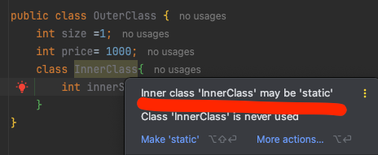
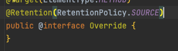

# Week03 deep-dive-discussions
- Q 보통 내부 클래스를 만들때, 정적 내부 클래스로 만드는게 더 좋다고들 하는데 그 이유는 무엇이며, 그렇게 했을 경우의 이점은 무엇인가?
  - 
    - 인텔리제이에서 내부 클래스를 선언하면 바로 던지는 경고. 
    - 내부 클래스의 인스턴스를 만들기 위해선, 먼저 외부 클래스의 인턴스를 생성한 후 내부 인스턴스를 생성해야한다. 이러한 단계에서 내부 클래스는 외부 클래스에 대한 외부 참조를 가지게 되는데, 이는 클래스 파일로 컴파일 할 시 발견된다. [참조](https://inpa.tistory.com/entry/JAVA-☕-자바의-내부-클래스는-static-으로-선언하자)
      - 내부 클래스의 생성자에 매개 변수로 외부 클래스의 인스턴스를 받아서 초기화 하게 된다.
    - 그러나 책에서도 명시하듯 정적 내부 클래스의 경우는 외부 클래스의 정적 필드/메서드만을 사용할 수 있으며, 이는 외부 참조가 없다는 뜻이 되어 아래의 메모리 누수를 일으키는 일이 없게된다.
  - Inner Class가 메모리 누수를 일으키는 이유는?
    - 내부 클래스의 경우 참조를 가지고 있게 되기 때문에, 만일 내부 클래스는 필요하나 외부 클래스는 더 이상 필요가 없어지는 경우가 생기더라도 (참조 때문에) 외부 클래스가 GC의 대상이 되지 못해 메모리에 계속 쌓이게 된다. 
  - 그렇다면 내부 클래스를 사용해야하는 경우는 언제일까?
    - 하나의 클래스에서 어떠한 공통 작업을 수행하는 클래스가 필요하나 다른 클래스에서는 그 클래스가 전혀 필요없는 경우에 만든다고 함 (책에 나와 있는 내용.)
    - AbstractList.Itr 이 예시가 될 수 있을 것 같은데, Itr 클래스는 AbstractList 의 modCount 라는 값을 이용해 리스트에 변경을 감지할 수 있는 로직을 Itr 클래스에 분리시켜 최대한 SRP 를 지키는 방식으로 개발하지 않았나 싶다.
      - Itr의 생명주기또한 무조건 AbstractList의 구현 인스턴스와 동일하거나 먼저 GC 대상이 되어야 하기도 한다.

- annotation 의 동작 원리는?
  - 에너테이션의 적용 시점은 어느 시점이며, 이 내용을 리플렉션으로 가져올 수 있는 이유는 무언지 찾아보자.
    - 에너테이션의 정보 유지 기간에 따라 다름.
    - `RetentionPolicy.SOURCE` -> 소스코드에는 포함되나, 에너테이션은 컴파일러가 참고하여 지정 동작을 수행한 후 클래스 파일에 포함되지 않고 날라감. 컴파일러가 컴파일하는 시점에 에너테이션을 제거.
      - 
      - 대표적인 에너테이션 중 하나인 override 의 경우, 컴파일러에게 이 메서드는 상속받는 클래스의 메서드를 override 한다는 것을 명시하고, 컴파일러는 이를 찾아 확인하여 검증을 하게 만드는 역할을 한다. 이후 클래스 파일 레벨에선 관련 검증이 끝났으니 제거.
    - `RetentionPolicy.CLASS` -> 컴파일 단계를 건너 클래스 파일에는 포함이 되지만, JVM에 로딩될 때는 제거됨. 클래스 로더가 제거함
      - 이 정책의 필요성이 굉장히 궁금했는데, maven/gradle 등으로 받는 라이브러리나 jar 파일에는 소스가 포함되지 않는다..! 그렇기에 필요한 정책인 듯함 [참고](https://jeong-pro.tistory.com/234#comment14510614)
        - 그 외에도 특수한 케이스일 것 같지만, 클래스 로딩시 특정 동작을 강제할 수도 있을 것 같긴하다. @PreviewFeature 에너테이션이 대표적인 듯 함. -> JDK 내부에서만 사용되는 에너테이션으로, 정식 릴리즈 이전에 실험적 기능의 미리 보기를 제공할때 사용하는 에너테이션.
    - `RetentionPolicy.RUNTIME` -> 소스코드의 실행시까지 포함되는 에너테이션으로, 사실상 사라지지 않는 에너테이션. 
      - 이 에너테이션이 사용된 경우, 자바의 reflection api 를 활용하여 에너테이션에 정보에 접근할 수 있게된다.
  - 리플렉션이 뭔지? 이름만 알고 어떻게 동작하는지 알아보지는 않았으니 확실히 알아보자.
    - 런타임(Runtime)에 클래스, 메서드, 필드, 생성자 등에 대한 정보를 동적으로 조회하고 조작할 수 있도록 설계된 기능. 자바의 정적 타입 시스템을 보완하여 유연한 프로그래밍, 프레임워크 개발, 동적 바인딩 등을 가능하게 함
      - 사용하는 케이스: 프레임워크들이 애노테이션 처리, DI 등을 구현 

- 저자는 객체지향 개발 관련 용어를 설명할 때 overriding 과 overloading 을 포함시켰다. 이 개념들이 객체지향 개발과 어떤 연관이 있고, 어떤 영향이 있는지 생각해 보자.
  - Overriding 
    - Single Responsibility Principle: 인터페이스의 어떠한 구현체여도 그 메서드에서 지정한 행위가 발생할 것
    - Open/Closed Principle: 서브 클래스에서 메서드를 오버라이드해서 변경하는 방법을 취하면 확장에는 열려있으나 수정에는 닫힌 개발이 가능
    - Dependency Inversion Principle: 추상 클래스 / 인터페이스의 경우 하위 모듈들을 사용하여 의존 역전을 만들어 낸다.
  - Overloading
    - Polymorphism: List.of(...) 처럼 매개변수를 활용해 리스트를 생성한다는 의미는 공통으로 가지나, 세부적인 구현은 다르게 하여 해당 List에 단일 책임을 부여한다.