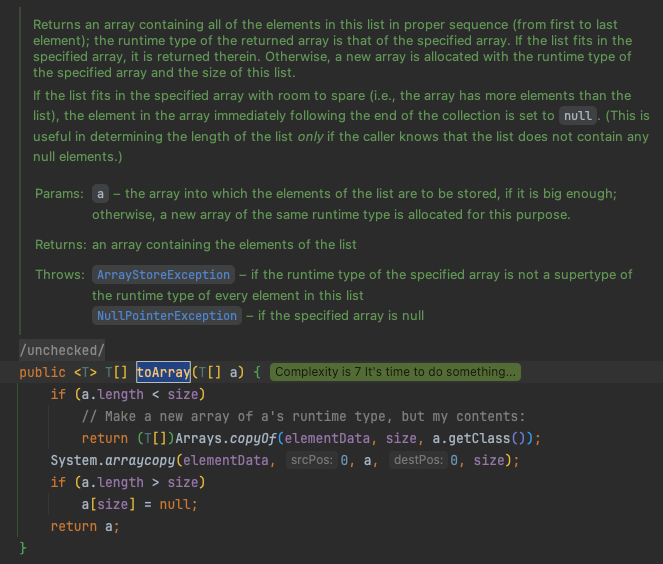

# Ch.22 자바랭 다음으로 많이 쓰는 애들은 컬랙션 - Part1 (List)

---
### 자바 컬랙션
- 자바에서 컬랙션은 목록성 데이터를 처리하는 자료구조를 통칭함
  - 배열을 만들고 배열의 크기가 부족하면 필요한 개수만큼 더 큰 배열을 하나 더 만들어서 거기다 복사해 버리는 방식.
- _<ins>자료구조란?</ins>_
  - 어떤 정보를 담는 것을 의미
  - 하나의 데이터가 아닌, 여러 데이터를 담을 때 사용한다.
  - 자바에서의 데이터를 담는 자료 구조
    - 순서가 있는 목록(List)형
    - 순서가 중요하지 않은 셋(Set)형
    - 먼저 들어온 것이 먼저 나가는 큐(Queue)형
      - 위 3개는 Collection 인터페이스를 구현함
    - 키-값(Key-Value)으로 저장되는 맵(Map)형

---
### List 인터페이스
- Collection과의 가장 큰 차이점은 순서가 있다. (배열처럼)
- 가장 많이 사용하는 구현 클래스:
  - ArrayList
  - Vector
    - 위 두 클래스들의 사용법은 거의 동일하고 성능도 거의 비슷함.
    - 확장 가능한 배열이라 생각하면 된다.
    - Vector는 1.0 부터, ArrayList는 1.2 부터
    - ArrayList는 Thread Safe 하지 않음
    - Vector는 Thread Safe 함.
  - Stack
    - Vector 를 확장함
    - LIFO 지원을 위해 만들어짐
  - LinkedList
    - List 와 Queue 를 다 구현함

---
### ArrayList에 대해 파헤쳐보자.
- ArrayList에는 3가지 생성자가 존재힘 
  - 기본 생성자로 생성된 ArrayList는 10의 크기를 가진다.
  - `ArrayList(Collection<? extends E> c)`  다양한 Collection 의 구현체를 매개변수로 받아 ArrayList를 생성. 매개변수로 받은 객체와 동일한 크기를 가짐
  - `ArrayList(int initialCapacity)` 지정한 크기로 생성
- size() 함수는 배열의 length 와 다르게 저장 공간 개수를 의미하는게 아닌 들어가 있는 데이터의 수를 의미함
  - 배열은 생성시 이미 지정된 만큼의 크기에 각각 지정한 값 혹은 기본값이 들어가 있기에 그 크기도 무조건 length와 같다.
- 🚨❗ **[의문점]** toArray() 메서드 호출시, 저자는 매개 변수로 사용하는 배열의 크기거 현재 ArrayList 보다 크거나 작을 경우, 배열의 모든 값이 null로 채워지기에 toArray(new Type[0]) 로 사용하는 것이 더 좋다고 했다. 그러나 ArrayList의 크기와 동일한 배열을 생성 (`arrayList.toArray(new Type[arrayList.size()])` 이런 식으로) 하면 문제가 없는데 왜 저장 공간이 0인 배열을 사용하는 것이 더 좋다고 하는 것일까?  
  - toArray의 구현 방식의 문제인 듯 하다. ArrayList는 thread safe 하지 않고, size 인스턴스 변수에 의해 함수 내부에서 분기가 일어나는데, 다른 스레드에서 해당 size 필드를 줄여버리게 되면 (이렇게 코드를 작성하는 경우가 흔한지는 모르곘음) 불필요한 null 이 생성되는 이슈가 있음.
  - 이와 반대로 저장 공간이 0이 할당된 배열을 넘기면 toArray 메서드 내부에서 무조건 첫 if 문을 타게되기에 위와 같은 걱정이 없게 됨.
    - 
    - 참조: [Intellij 에서 분석한 내용](https://github.com/JetBrains/intellij-community/blob/master/java/java-impl/resources/inspectionDescriptions/ToArrayCallWithZeroLengthArrayArgument.html)

---
### Stack 클래스는 뭐가 다른데?
- LIFO 기능의 구현을 위해 만들어진 클래스
  - 그러나 **LIFO 기능을 위해 이 클래스를 사용하는 것은 권장하지 않는다**. 
    - 이 클래스보다 더 빠른 ArrayDeque 가 존재함.
      - 문제는 ArrayDeque 는 Thread safe 하지 않음.
    - Thread safety 를 보장해야 할 경우에 사용하는 것을 권장한다고 함.