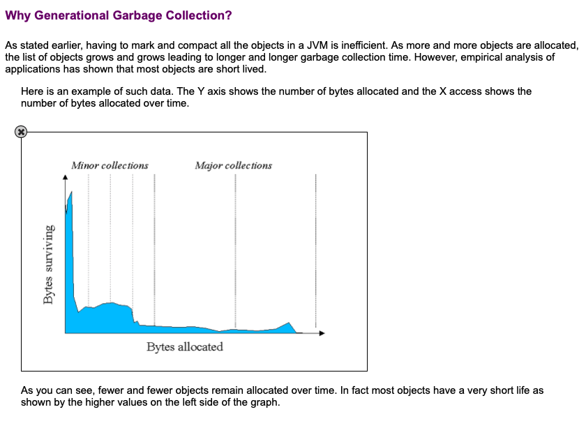

# Week04 deep-dive-discussions
1) JVM 메모리 & GC 구조 
   - Young(Eden/Survivor) → Old 구조를 쓰는 이유?
     - 1. 객체의 라이프 사이클이 짧고, 
       2. 오래된 객체에서 젊은 객체로의 참조는 아주 드물게 발생한다
       3. 
          - [오라클에서 제공하는 데이터](https://www.oracle.com/webfolder/technetwork/tutorials/obe/java/gc01/index.html)로 대부분의 객체는 빨리 죽는다는 걸 보여줌.
     - 위 두가지 이유를 근거로 금방 죽을 객체와 오래 살아남을 객체를 다른 방식으로 처리하기 위해 고안한 구조.
        - 이 구조를 통해 마이너 GC를 자주 발생시켜 Young gen 에 있는 데이터들을 빠르게 처리할 수 있게 만들어 준다.
          - 왜 minor gc 는 더 빠른가?
            - 책에도 나와있듯이 Young gc는 더 작은 메모리 공간을 할당돰. 
            - mark-and-sweep 알고리즘을 통해 reachable 한 객체들을 다음 영역으로 이동 (mark), 이전 영역에 남은 unreachable 한 객체들의 메모리를 해제 (sweep). 살아남은 객체들은 age 가 1씩 증가 (HotSpot JVM의 임계값은 31이며, 이 값이 넘으면 old gen 으로 이동)
          - major GC는 왜 더 느린가?
            - old gen 에서 일어나는 GC의 경우, 존재하는 모든 객체 전체에 대해 stop-the-world 가 발생하고, 전체 unreachable한 객체들을 찾아낸 후 sweep 처리한 다음 compacting 이 일어나 메모리 파편화를 방지함.
     - 참조: https://www.youtube.com/watch?v=Fe3TVCEJhzo&list=WL&index=4
   - 전체 힙을 Young처럼만 운영하면 장애 확률이 높아지는 이유?
     - 오래 살아남는 객체도 불필요하게 계속 메모리 블록을 옮겨 다녀야 하며, 대상이 되는 객체도 커지기에 stop-the-world 시간이 기하급수적으로 늘어나게됨.
     - 승격후 이동되는 old 가 없어지게 됨으로, 장기 객체가 늘어나면 늘어날 수록 gc가 연쇄 발생되어 오히려 메모리 부족 문제가 발생함.
   - “기본 자료형은 스택, 참조/객체는 힙” 관점 + “메모리 영역을 나누는 이유?”
     - 힙은 동적 메모리 할당에 사용하는 영역이고, 프로그램 실행 중에 동적 객체 생성되는 객체에 따라 메모리가 할당되어야 함. 그 이후 사용이 끝난 메모리는 GC에 의해 처리됨. (정책에 대한 고려가 필요할 수도 있음)
     - 스택은 정적 메모리 할당에 사용되는 영역이고, 컴파일 시점에 메모리 크기가 결정된다. 사용했던 메모리는 메서드의 호출이 종료되면 자동으로 해제된다.
       - 메서드가 호출되면 스택 프레임이라는 구조가 하나 생성되고, 그 프레임 안에 스택형식으로 데이터가 쌓였다가 메서드가 종료되면 프레임 전체가 사라지는 방식.
     - 스택의 경우 LIFO 구조로 되어 있는 프레임에서 스택 포인터를 이동하기만 하면 원하는 메모리 대상을 찾을 수 있기에 훨씬 효율이 좋음.

---
2) 컬렉션 & 동시성
   - stack(클래스) 가 왜 Vector를 잘못 상속받았는가?
     - stack 은 LIFO 자료구조여야 하는데, Vector 에는 `insertElementAt(), removeElementAt()` 등의 특정 인덱스에 삽입하거나 지우는 메서드가 존재함. -> 이는 명백한 구조적 오류. 
   - 왜 thread-safe한 Vector보다 non-thread-safe한 ArrayList를 더 선호하는가?
     - 불필요한 동기화 비용 발생
       - Vector의 메서드들 대부분인 synchronized 키워드를 달고 있어 race condition의 검증을 해야해 동기화 여부에 대한 검증이 필요없는 환경에서도 불필요하게 검증을 하게 됨
     - 완벽하게 동기화 되지는 않기 떄문에 정말 thread-safe 하지는 않음
       - 메서드에는 synchronized 키워드가 붙어있으나, 벡터 인스턴스 객체는 동기화가 되어있지 않기에, 많은 쓰레드들에서 객체에 접근해 메서드를 호출하면 race condition이 결국 발생한다.
   - 그럼 Vector의 적절한 사용 예시는? (레거시 호환/특수 케이스)
     - 일부 라이브러리나 툴킷(Swing, AWT 등)은 여전히 Vector를 파라미터나 리턴 타입으로 사용하는 경우가 있다고 함.

---
3) 오토박싱/언박싱 & 래퍼 캐시
   - 오토박싱/언박싱은 어떻게 동작하는가?
     - 컴파일러가 컴파일 시점에 코드를 변환 시켜줌.
       - ex: 
         - 오토박싱: `Integer a = 10` => `Integer a = Integer.valueOf(10);`
         - 언박싱: `int b = a` => `int b = a.intValue();`
   - 오토언박싱의 성능 영향은?
     - 오토박싱의 경우 객체의 생성이 발생되기에, 메모리 할당 문제가 발생할 수 있다. 
   - 오토박싱/언박싱을 피해야 하는 상황과 이유는?
     - null 가능성이 있는 경우
     - 멀티 쓰레드 환경에서 공유 객체를 다뤄야하는 경우
       - 오토박싱/언박싱으로 신규 객체가 계속 생겨나면 race condition 혹은 GC 오버헤드가 발생할 수 있음.
     - 오토박싱: 객체의 생성이 일어나기 때문에 메모리 활용을 위해 반복문에서는 피하는게 좋을 듯 하다.
   - Integer.valueOf(int)는 어떻게 동작하는가?
     - 객체를 생성하거나, 캐싱된 객체를 재사용합니다.
       - 캐시 범위 (-128 ~ 127) 을 벗어나면 `new Integer(i)` 로 신규 객체가 생성됨. 
   - 내부 캐시 범위/구현과 그로 인한 동작·성능 영향은?
     - -128 ~ 127 범위는 JVM에서 캐싱(IntegerCache)합니다.
     - == 비교를 캐싱되는 범위까지만 지원하게됨.
