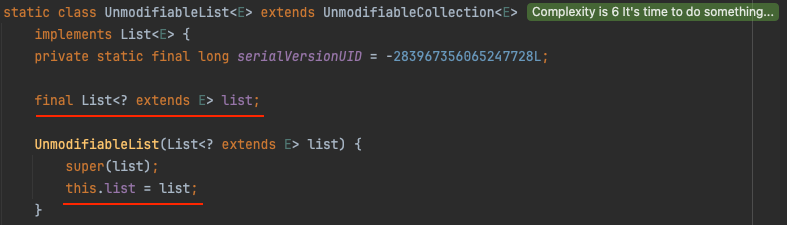
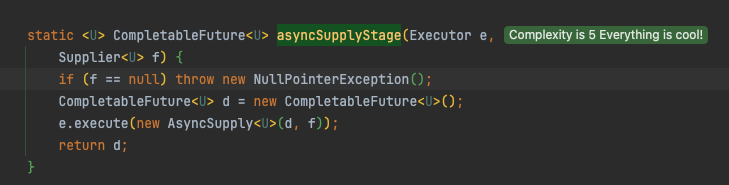
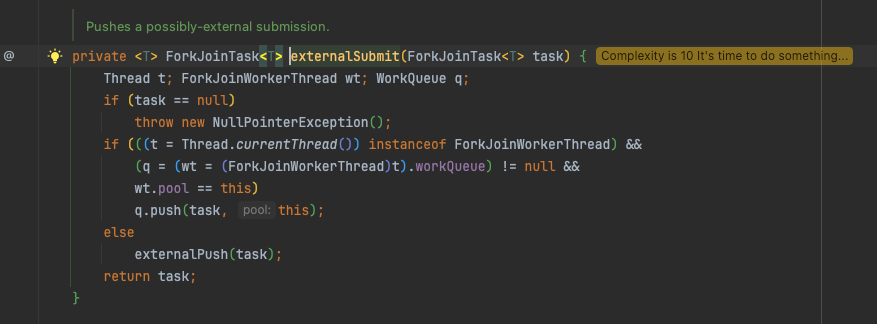

## Week06 deep-dive-discussions

---
1. Collections.unmodifiableList()는 왜 진짜 불변성이 아닌가?
    - unmodifiableList()의 구현 (Java 8)  
      ```java
        public static <T> List<T> unmodifiableList(List<? extends T> list) {
        return (list instanceof RandomAccess ?
                new UnmodifiableRandomAccessList<>(list) :
                new UnmodifiableList<>(list));
        }
      ```
      - 위 코드중 UnmodifiableRandomAccessList 도 결국 UnmodifiableList의 자식이고 생성자에서 super를 호출한다. 
    - 
    - 이렇게 생성되는 객체의 경우 생성자 매개변수로 전달받은 list를 참조하게 되고, 원본 리스트의 변경이 이루어지면 생성한 unmodifiableList도 변경된다.
      - add, set, remove 함수들은 UnmodifiableList의 해당 메서드들에서 예외처리하고 있다.
    - 이러한 변경을 막을려면 어떻게 해야하는가?
      - 자바 9 부터 사용가능한 List.of() 를 사용할 경우, 인자로 받은 값들을 통해 신규 리스트가 생성되며 별도의 객체로 처리가 됨.  
---
2. 람다 표현식의 내부 구현 방식은? 
    - 책에서 말하던 도입의 목표와는 달리. 람다 표현식은 익명 함수를 구현하는 방식으로 동작하지 않는다.
      - **컴파일시 익명 클래스 파일이 생성되지 않는다.**
    - invokedynamic 이라는 바이트코드 명령어를 활용해 실재 구현을 런타임까지 미루고, 컴파일 시점에는 부트스트랩 메서드를 생성해두어 실제 람다가 호출되면 부트스트랩 메서드를 호출함
    - 이 부트스트랩 메서드에서 LambdaMetafactory.metafactory 를 사용해 실재 구현하는 메서드를 동적생성한 후 사용함.

---
3. DTO/VO를 기존 클래스 vs Record로 작성했을 때의 차이?? 
    - record의 동작원리는 컴파일시 해당 클래스를 java.lang.Record를 상속받는 클래스로 만들고 private final로 필드 생성 + 메서드들 (toString, equals, hashCode, getter(get 네이밍없이), canonical constructor(all args const)) 를 자동으로 생성하는 방식이다. 
      - 책의 예제 record를 컴파일할시의 결과물:
```java
jonghyunyoo@JONGHYUNui-MacBookPro src % javac c/inheritance/mine/BookRecord.java
jonghyunyoo@JONGHYUNui-MacBookPro src % javap -c -p c.inheritance.mine.BookRecord
Compiled from "BookRecord.java"
public final class c.inheritance.mine.BookRecord extends java.lang.Record {
	private final java.lang.String title;

	private final java.lang.String author;

	private final java.lang.String category;

  public c.inheritance.mine.BookRecord(java.lang.String, java.lang.String, java.lang.String);
	Code:
	0: aload_0
	1: invokespecial #1                  // Method java/lang/Record."<init>":()V
	4: aload_0
	5: aload_1
	6: putfield      #7                  // Field title:Ljava/lang/String;
	9: aload_0
	10: aload_2
	11: putfield      #13                 // Field author:Ljava/lang/String;
	14: aload_0
	15: aload_3
	16: putfield      #16                 // Field category:Ljava/lang/String;
	19: return

	public final java.lang.String toString();
	Code:
	0: aload_0
	1: invokedynamic #19,  0             // InvokeDynamic #0:toString:(Lc/inheritance/mine/BookRecord;)Ljava/lang/String;
	6: areturn

	public final int hashCode();
	Code:
	0: aload_0
	1: invokedynamic #23,  0             // InvokeDynamic #0:hashCode:(Lc/inheritance/mine/BookRecord;)I
	6: ireturn

	public final boolean equals(java.lang.Object);
	Code:
	0: aload_0
	1: aload_1
	2: invokedynamic #27,  0             // InvokeDynamic #0:equals:(Lc/inheritance/mine/BookRecord;Ljava/lang/Object;)Z
	7: ireturn

	public java.lang.String title();
	Code:
	0: aload_0
	1: getfield      #7                  // Field title:Ljava/lang/String;
	4: areturn

	public java.lang.String author();
	Code:
	0: aload_0
	1: getfield      #13                 // Field author:Ljava/lang/String;
	4: areturn

	public java.lang.String category();
	Code:
	0: aload_0
	1: getfield      #16                 // Field category:Ljava/lang/String;
	4: areturn
}            
```
.  
  - 굳이 더 이점이 있는 부분을 꼽자면, 개발자의 의도하지 않은 실수를 캐치할 수 있는 부분이 될 것 같다. (setter 의 생성이나, 필드를 final로 선언하지 않는 등)

---
4. 저자는 `자바의 Fork / Join 은 전부 Fork/Join 기능은 java.util.concurrent 패키지의 RecursiveAction과 RecursiveTask라는 abstract 클래스를 사용해야 한다.` 라고 명시했으나, 자바8에서 등장한 CompletableFuture의 경우에는 해당 클래스들을 상속받거나 사용하지 않고 있다. CompletableFuture는 어떻게 Thread의 Fork / Join을 가능하게 할까?
   - CompletableFuture는 Recursive 클래스들 처럼 태스크 분할 전략을 직접 정의하지 않고, 대신 비동기 실행 파이프라인을 표현하는 고수준 API.
   - runAsync, supplyAsync 메서드 전부 내부적으로 CompletableFuture<U>.AsyncSupply.asyncSupplyStage라는 메서드를 사용하고, 이 메서드 내부에서 매개 변수로 받은 Executor를 사용하는데 이 떄 기본으로 사용되는 Executor가 ForkJoinPool.commonPool. 
   - 
   - Executor 에 의해 execute 될 때 ForkJoinPool의 아래 함수를 실행시켜 큐에 등록 -> 워커 스레드 들이 work-stealing 알고리즘을 수행해 가져와 실행함.
     - 즉 RecursiveTask 등을 통해 직접 실행하는 방식이 아닌, 풀에 의해 처리되는 구현을 만듦.
   - 

---
5. 인터페이스의 default 메서드는 어떻게 가능한 것일까?
- 컴파일 시 모든 구현체에 해당 메서드가 포함되는 구조인가?
  - 컴파일 시, JVM 바이트 코드 레벨에서는 인터페이스라고 할지라도 default/static 메서드를 가질 수 있고, 구현체에서는 이 바이트코드를 참조하여 사용하는 구조라고 한다.
    - 이때 jvm이 사용하는 명령어가 `invokeinterface` 로 인터페이스의 구현부를 호출하는 명령어 인 듯 하다. 
      - 인터페이스를 구현하거나 추상 클래스의 구현을 할 때, 컴파일러와 JVM은 어떻게 동작해서 이렇게 기존 바이트 코드를 참조하는 것일까?
        - 인터페이스의 경우 다중 상속이 가능하기 때문에 다른 두 인터페이스가 똑같은 시그니처의 디폴트 메서드를 가지고 있고, 어떤 클래스가 그 두 인터페이스의 구현체라면 반드시 해당 메서드를 override 해주어야 한다.
          - 왜냐하면 컴파일된 코드는 invokeinterface 를 직접 호출하는 것이 아니라, invokevirtual 이라는 명령어를 사용해 상속 체인을 올라가며 메서드를 탐색한 후 찾으면 그 메서드를 실행시킴. (그래서 javap -c -p 로 컴파일된 코드를 살펴봐도 invokeinterface는 보이지 않음)